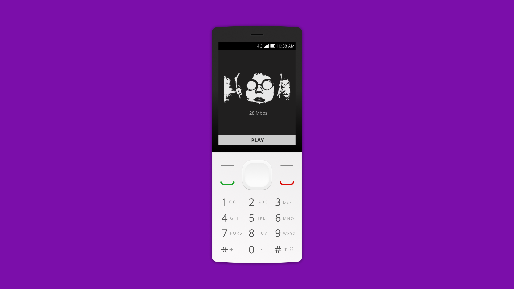

# [Tilos Radio](https://tilos.hu/page/english) for [KaiOS](https://www.kaiostech.com/)

This (unofficial) app allows you to play Tilos Radio's live stream while walking with your phone in your pocket.

This is currently impossible if you listen to the live stream using the KaiOS browser.
The browser default behavior is to stop all media when the screen is locked, or you navigate to another page, or when you quit the browser.  

Tilos Radio for KaiOS works as the Music app. You can run the app in the background without interrupting the audio.

## User guide



To play or pause the live stream, press the `Enter` key.

Use the `Up` and `Down` keys to control the audio volume. 

You can change the audio quality using the `1` (256 Mbps), `2` (128 Mbps), and `3` (32 Mbps) keys.

## Installation

The app is not available through the [KaiStore](https://www.kaiostech.com/store/)
They are only accepting apps that are [monetized using KaiAds SDK](https://developer.kaiostech.com/submit-to-kaistore), and that's something I'm not interested in integrating.

For this reason, you have to side-load (upload) the app to your phone if you want to use it.

Martin Kaptein wrote a comprehensive, [step-by-step article](https://www.martinkaptein.com/blog/sideloading-and-deploying-apps-to-kai-os/) that you can use to side-load the app.
If you prefer a video, [this one on YouTube](https://www.youtube.com/watch?v=hQ2EJnNuFz0) walks you through the process.

The Developer Portal also contains a [guide](https://developer.kaiostech.com/getting-started/env-setup/os-env-setup), and if nothing seems to work, you can [ask for help on Discord](https://discord.com/invite/rQ93zEu).

You can download the latest version from the [Releases](https://github.com/meszarosrob/tilos-radio-for-kaios/releases) page.

The app is not auto-updating. To update it, you have to follow the same steps you took when installing it.

## Changelog

See the [CHANGELOG.md](CHANGELOG.md).

## Development

### Build the app locally

Assuming you have Node.js and npm on the machine, after installing the packages, run:

```shell script
npm run-script production
```

If you want to start a dev server and rebuild the app as you change files, run: 

```shell script
npm run-script dev
```

### Linting the code

Currently, there is only linting for the JavaScript files. Use it by running:

```shell script
npm run lint
```

To fix what is possible automatically:

```shell script
npm run lint:fix
```

### Release a new version

Once you documented the notable changes in the [CHANGELOG.md](CHANGELOG.md), run:

```shell script
./bin/update-version.sh 1.0.0
```

The script uses [jq](https://stedolan.github.io/jq/) for processing the JSON files.
If you don't have it installed, you can change the version manually in the files.

Commit the changes and create a new Git tag using the version you chose but prefix it with a `v`:

```shell script
git tag v1.0.0
```

Pushing a new tag will kick-start the [release workflow](.github/workflows/release.yml).
It will build the app and make it available for download as a ZIP file, and it will prepare the release note based on the changelog.

## Misc and plans

The app uses [`tilos-radio-for-kaios.netlify.app`](https://tilos-radio-for-kaios.netlify.app/) instead [`stream.tilos.hu`](http://stream.tilos.hu/)  for audio streaming because the URL has to be under `HTTPS` due to security.
Setting up a [proxy](https://docs.netlify.com/routing/redirects/rewrites-proxies/#proxy-to-another-service) was a workaround, and hopefully, I can remove it in the future.

I wish to display the current show's name and its schedule in an upcoming release, but currently, this is not possible due to the Tilos Radio API's [CORS](https://developer.mozilla.org/en-US/docs/Web/HTTP/CORS) configuration.

The `public` folder is for the Netlify website. 

Having the entire archive accessible through the app would be nice, but at the moment, it's out of scope.

## Contributing

The issue tracking is disabled and will remain like that.
If you find a bug, please submit a PR with the fix.

You are also welcome to submit PR that improves what you read so far.

For other dramatic changes, please fork the project.
If you made a significant improvement, please reach out, and I'll encourage everybody to use your version.

## Copyright

See the [UNLICENCE](UNLICENSE).

The Tilos Radio logo is (probably) copyrighted to Tilos Cultural Foundation.
